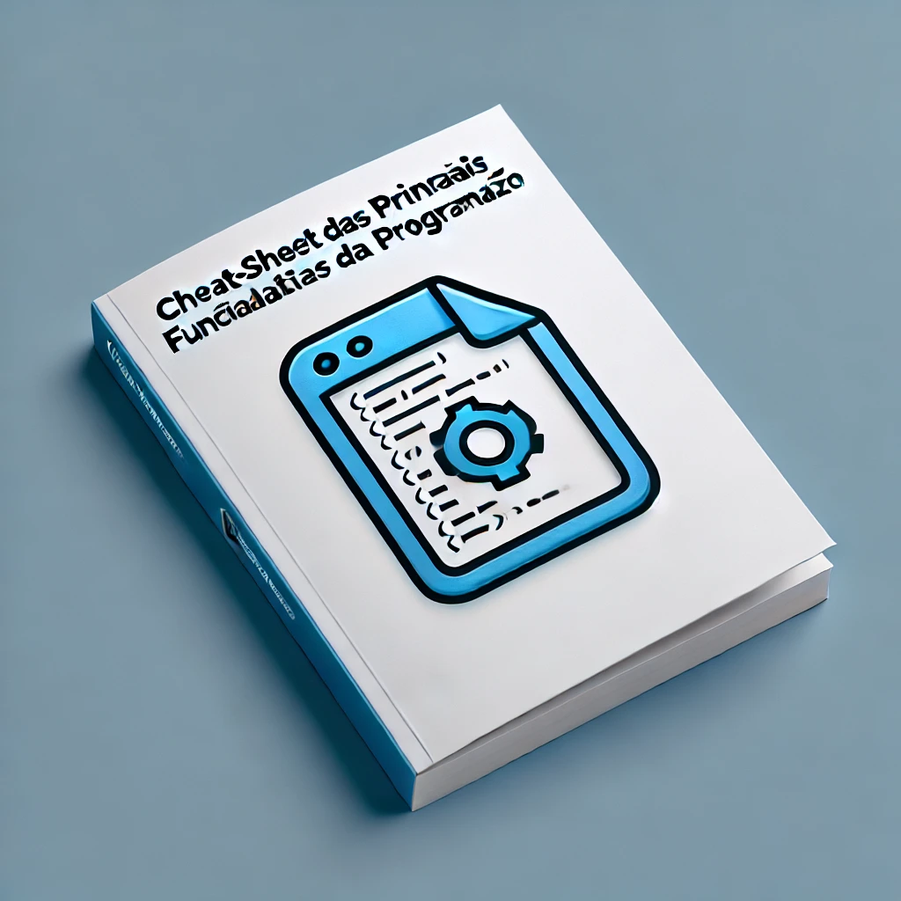

# Cheat-Sheet das Principais Funcionalidades da Programação

Este e-book reúne as principais funcionalidades e recursos de programação em um formato fácil de consultar. Ideal para iniciantes e programadores experientes.
## Atenção: o conteúdo deste e-book foi gerado com a ajuda do CHATGPT
